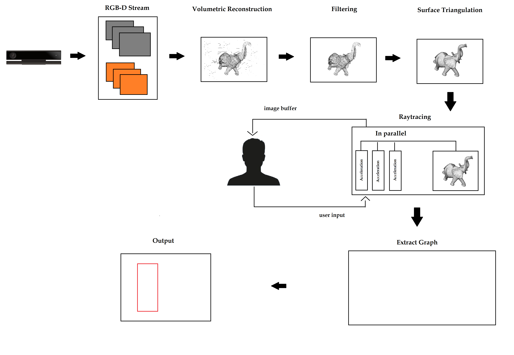
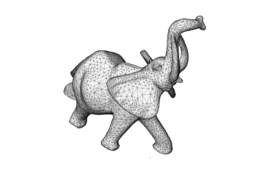
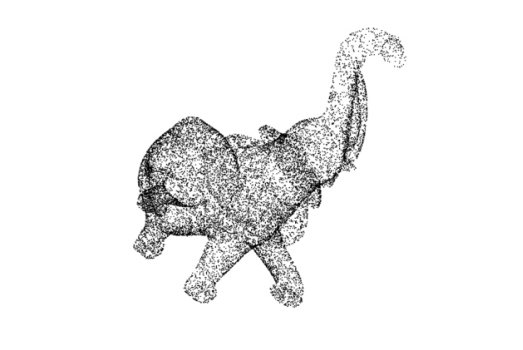

# Scansify

A 3D computational scan tool for designing customized, thin layered sensors for on-skin interaction. Built as a Bachelor's thesis project at the Saarland University HCI group.

> **Status:** Archived. This was a thesis project completed for its degree requirement and is no longer actively developed.

## Project Description

Recent HCI research shows that on-body sensors change the way people interact with their environment, but fabricating sensors that conform to an individual's body is costly and largely manual: sizes are measured by hand, and mistakes mean starting over.

Scansify addresses this by using a low cost RGB-D camera (Kinect v2) to scan a person's arm, letting the user annotate a design directly on the live 3D reconstruction, and then unwrapping that annotation into a flat 2D shape ready for fabrication.

Core functionality:

- Capture the human body with an RGB-D camera to acquire precise geometry (via KinectFusion)
- Live display of the reconstruction process and depth stream from the camera
- Annotate the digital 3D body model through a graphical interface
- Unwrap algorithm that converts the 3D drawing into a 2D shape/graph, exported as SVG for fabrication
- Import/export of designs and 3D models
- Undo latest change or fully reset the design
- Camera manipulation (steering, zooming, rotating) via an arcball camera

A user study was conducted to evaluate feasibility and usability; see `thesis.7z` for the full write-up.

## Pipeline

```
Kinect v2 → RGB-D Stream → Volumetric Reconstruction → Filtering → Surface Triangulation
                                                                          │
                                                                          ▼
                    Output (SVG) ← Extract Graph ← Raytracing (BVH/SAH, mouse-picking, user annotation)
```



## Screenshots

Example scan of a test object as it moves through the pipeline, raw reconstruction filtered into a clean surface:

<p align="center">
  
  
</p>

## Architecture

Written in C++ as a native Windows (MFC) application:

- `v2/main.cpp`, `main.h` — application entry point and window/mode handling (Annotation, Reconstruction, Initial), based on Microsoft's KinectFusionExplorer-D2D sample
- `v2/KinectFusion/` — volumetric reconstruction, tracking, and surface shading (KinectFusion SDK integration)
- `v2/ImageRenderer.*` — Direct2D rendering of the reconstruction/depth/color streams to the GUI
- `v2/rt/` — custom raytracer used for rendering and mouse-picking (perspective camera, BVH/SAH acceleration, triangle/plane primitives)
- `v2/svghelper.*` — exports the unwrapped 2D annotation graph as SVG for fabrication
- `study/` — configuration for the user study sessions

## Built With

* Kinect v2 (hardware) + Kinect for Windows SDK 2.0
* Visual Studio 2017
* KinectFusion (Microsoft's volumetric reconstruction framework)

Make sure to install the SDK/runtime matching your target architecture (x86 or x64).

## Building

Open `v2/Scansify.sln` in Visual Studio 2017 with the Kinect for Windows SDK 2.0 installed, select your target platform (x86/x64), and build. A Kinect v2 sensor is required to run the reconstruction pipeline.

## Related

Equivalent, incomplete .NET/C# implementation: [Skin-Detection-Tool](https://github.com/PewhProgrammer/Skin-Detection-Tool)

## License

Apache 2.0

## Author

Ba Thinh Tran — [PewhProgrammer](https://github.com/PewhProgrammer)
